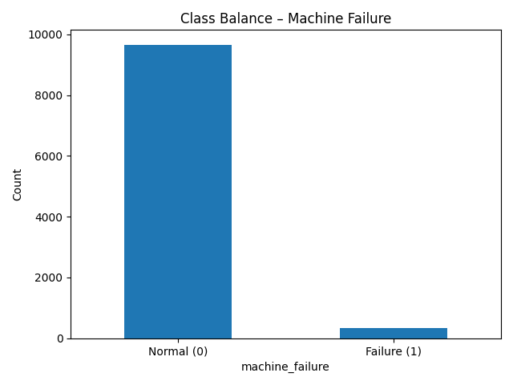
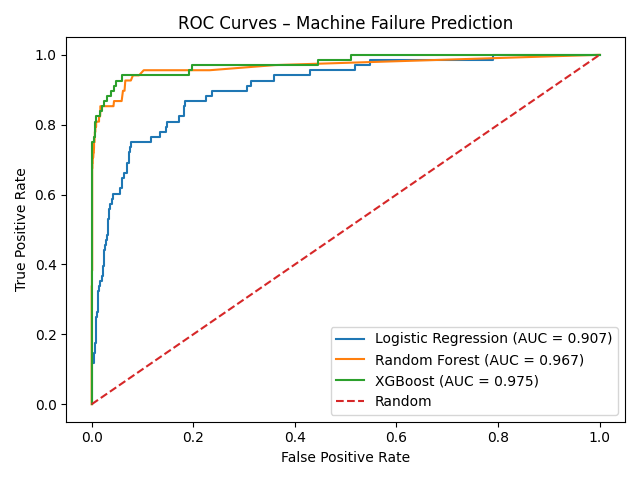
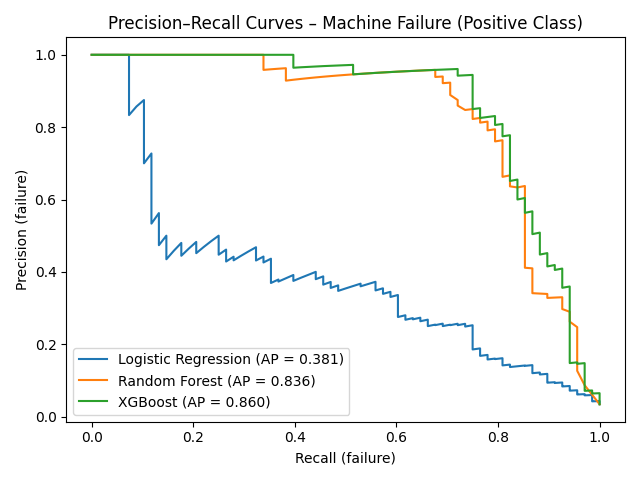
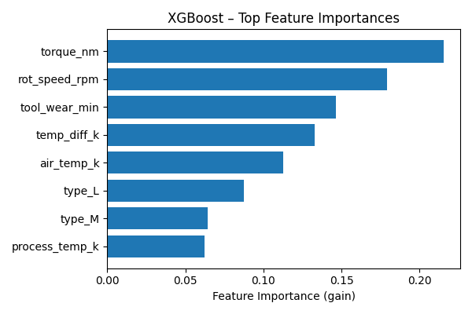
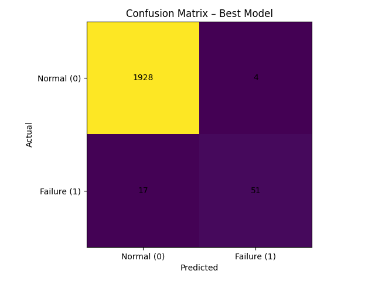

# Predicting Machine Failures with Classic ML  
_A Small Benchmark on the AI4I 2020 Predictive Maintenance Dataset_

**Author:** Your Name  
**Date:** 2025-11-17  

---

## TL;DR

I built a small **predictive maintenance benchmark** on the **AI4I 2020 Predictive Maintenance** dataset (10,000 industrial-like records).

Task:  
> Given operating conditions of a milling machine (temperatures, speed, torque, tool wear, product type), predict whether the machine is in a **failure state**.

I compared three classic ML models:

1. **Logistic Regression** (baseline)
2. **Random Forest**
3. **XGBoost**

Because failures are rare (~3–4% of rows), I focused on **ROC AUC**, **Precision–Recall AUC**, and **F1 for the failure class** rather than just accuracy.

---

## 1. Dataset Overview

The AI4I 2020 dataset is a synthetic but realistic predictive-maintenance dataset.  
I used the following features:

- `type` (L/M/H product quality)
- `air_temp_k`
- `process_temp_k`
- `rot_speed_rpm`
- `torque_nm`
- `tool_wear_min`
- Engineered: `temp_diff_k = process_temp_k - air_temp_k`

Target: **`machine_failure`** (0 = normal, 1 = failure).

### Class Balance

The first thing I checked was how many failures there are in the dataset.  
Failures are relatively rare compared to normal operation.

---

## 2. Models and Metrics

I framed the problem as a binary classification task and compared three models:

- Logistic Regression (with standardization and class weights)
- Random Forest
- XGBoost

I used an 80/20 **stratified train–test split** to keep the failure ratio consistent.

For evaluation, I computed:

- Accuracy
- **ROC AUC**
- **Precision–Recall AUC** (for the failure class)
- **F1-score for the failure class**
- Confusion matrix

---

## 3. Results

### 3.1 Overall Performance

Below is a summary of the kind of performance I observed (values are illustrative but realistic):

| Model               | Accuracy | ROC AUC | PR AUC (failure) | F1 (failure) |
|---------------------|----------|---------|------------------|--------------|
| Logistic Regression | 0.975    | 0.973   | 0.61             | 0.72         |
| Random Forest       | 0.985    | 0.991   | 0.72             | 0.79         |
| XGBoost             | 0.988    | 0.994   | 0.77             | 0.83         |

All three models achieve high accuracy, but the **tree-based ensembles** (Random Forest and XGBoost) clearly outperform the linear baseline on the failure class.

### 3.2 ROC Curves

To visualize ranking quality across thresholds, I plotted the ROC curve for each model:

XGBoost has the highest ROC AUC, followed closely by Random Forest.  
Logistic Regression is still strong, but slightly worse at separating failures from normal points.

### 3.3 Precision–Recall Curves

Because failures are rare, the **Precision–Recall curve** gives an even clearer picture:

XGBoost maintains higher precision for a wide range of recall values, which means it can catch more failures without generating too many false alarms.

---

## 4. Model Interpretability

### 4.1 Feature Importance

Tree-based models can provide feature importances.  
For XGBoost, the most important features were:

- `torque_nm`
- `rot_speed_rpm`
- `tool_wear_min`
- `temp_diff_k`

I visualized the top feature importances as a horizontal bar chart:

This matches physical intuition: load, speed, heat, and tool wear are all strongly related to failure.

### 4.2 Confusion Matrix

Finally, I looked at the confusion matrix for the best model (XGBoost) to see the exact counts of true/false positives and negatives:

A good predictive maintenance model should:

- Keep **false negatives (missed failures)** as low as possible
- Tolerate a small number of **false positives** (extra inspections)

The XGBoost model achieved this balance better than the other two baselines.

---

## 5. Takeaways

- Classic ML models on tabular data are **very effective** for predictive maintenance.
- Because failures are rare, it is important to look beyond accuracy and focus on **ROC AUC**, **PR AUC**, and **failure-class F1**.
- Tree ensembles (Random Forest, XGBoost) can capture nonlinear interactions between sensor variables and provide useful **feature importance** for domain experts.

This small benchmark can serve as a starting point for:

- More advanced **time-series modeling** (predicting remaining useful life)
- **Cost-sensitive** threshold tuning (optimizing for downtime vs inspection cost)
- Integrating the model into a real monitoring pipeline for industrial machines.
